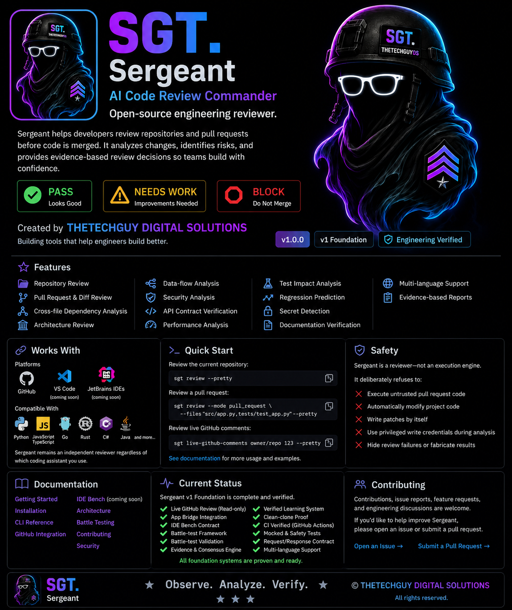

<p align="center">
  
</p>

# Sergeant

**Sergeant (SRG)** is an open-source software engineering review system created by **THETECHGUY DIGITAL SOLUTIONS**.

Sergeant helps developers inspect repositories, review pull requests, verify engineering standards, and produce evidence-based reports. It is built to fit existing developer workflows and AI provider choices instead of locking a project into one model or platform.

Sergeant is not another one-shot coding assistant. It is a reviewer: it checks work, challenges assumptions, collects proof, and reports what should happen before code is merged or released.

```text
PASS
NEEDS WORK
BLOCK
```

## Who Sergeant is for

Sergeant is useful for:

- Individual developers who want a second engineering review before shipping.
- Open-source maintainers reviewing pull requests and project changes.
- Software teams that care about standards, evidence, and repeatable review flow.
- AI-assisted development workflows where generated code still needs independent review.
- Self-hosted or model-agnostic environments that should not depend on one provider.

## Why Sergeant exists

Most AI coding tools focus on generating code.

Sergeant focuses on reviewing software engineering work.

It helps developers and teams answer:

- Is this change safe enough to merge?
- What evidence supports the review?
- What standards does the work meet or miss?
- What must be fixed before release?
- What did external reviewers, CI, tests, or real project evidence show?
- Where is the real engineering risk?

## Core principles

- **Evidence before opinion.**
- **Standards before assumptions.**
- **Review before merge.**
- **Verification before release.**
- **Human judgment remains final.**

Sergeant can work beside coding assistants such as Claude, Codex, Copilot, Cursor, Gemini, local LLMs, or OpenAI-compatible providers. Those tools may help write code. Sergeant stays focused on independent review and evidence.

## Engineering workflow

Sergeant follows a disciplined engineering workflow:

```text
Understand
    ↓
Review
    ↓
Challenge
    ↓
Verify
    ↓
Freeze
    ↓
Prove
    ↓
Ship
```

The first step matters: Sergeant should understand the objective, architecture, and intended standard before deciding whether something is wrong.

## How Sergeant works

```text
Developer
   │
   ▼
Sergeant
   │
   ├─ Repository
   ├─ Pull Request
   └─ Change Set
   │
   ▼
Evidence Collection
   │
   ▼
Standards Verification
   │
   ▼
Report Ready
```

Sergeant reviews the available evidence, compares it against engineering standards, and returns a clear outcome: `PASS`, `NEEDS WORK`, or `BLOCK`.

## Operational status

```text
Status:        Standing By
Version:       v1
Mission:       Operational
Proof Status:  Verified
Battle Status: Passed
Next Phase:    V2
```

## Current v1 capability set

### Repository review

- Repository inspection
- Pull request and change-set review
- Changed-file and diff analysis
- Repository understanding
- Architecture and regression risk checks

### Engineering review

- Static analysis signals
- Security and safety boundary checks
- Documentation drift checks
- Evidence consensus
- Verified learning loop
- Standards verification
- Review intelligence
- Squad-style review intelligence

### Developer workflow

- CLI review flow
- App bridge contract
- IDE Bench contract for VS Code, PyCharm, JetBrains, and AI handoff
- VS Code extension commands
- Read-only GitHub PR comment ingestion
- Live GitHub review bridge
- Works with local models, self-hosted deployments, and OpenAI-compatible providers

### Proof and battle validation

- Battle-test fixtures and validator
- CI proof
- Clean-clone proof
- App bridge proof
- IDE contract proof
- Mocked live GitHub proof
- Release proof checks

## Installation

```bash
git clone https://github.com/jaydumisuni/Sergeant.git
cd Sergeant
python -m pip install -e .
```

Requires Python 3.10 or newer.

## Quick start

Review the current repository:

```bash
main-review review . --pretty
```

Run the app bridge contract:

```bash
main-review app-review . --mode pull_request --files "src/app.py,tests/test_app.py" --pretty
```

Fetch read-only live GitHub PR comments:

```bash
main-review live-github-comments owner/repo 12 --pretty
```

Run live GitHub comments through the review bridge:

```bash
main-review live-github-review owner/repo 12 . --pretty
```

Show IDE handoff contract:

```bash
main-review ide-bench-contract --pretty
```

Run from PyCharm or VS Code without installing the console script:

```bash
python sergeant.py ide-bench-contract --pretty
```

VS Code launch configs are in `.vscode/launch.json`.

PyCharm run configs are in `.idea/runConfigurations/`.

Install Sergeant as a local VS Code extension:

```bash
npx @vscode/vsce package --no-dependencies
code --install-extension sergeant-reviewer-0.1.1.vsix --force
```

After installation, Sergeant appears in the VS Code Extensions view and provides these commands from any workspace:

- `Sergeant: Review Workspace`
- `Sergeant: IDE Bench Contract`

Validate battle-test fixtures:

```bash
main-review battle-tests --pretty
```

Run the self-check gate:

```bash
main-review verify-standard --pretty
```

A clean self-check returns:

```json
{
  "status": "verified",
  "next_actions": []
}
```

## Battle testing

Sergeant is not tested only against synthetic examples.

Battle testing means running Sergeant against real public pull requests and real engineering review situations, then comparing its findings with the kinds of concerns maintainers and reviewers actually raised.

Current fixtures include:

- `psf/requests#7502` — focused regression and test-clarity review case
- `pallets/flask#5812` — larger architecture and lifecycle review case

Current battle status:

```text
GitHub Battle Tests:      Passed
Repository Battles:       Passed
Pull Request Battles:     Passed
Review Comparison:        Passed
Evidence Validation:      Passed
```

The next proof phase is wider language and ecosystem battle testing across Python, JavaScript / TypeScript, Go, Rust, Java / Kotlin, C#, and C / C++ repositories.

## Proof suite

Sergeant treats proof as more than ordinary unit tests.

The proof suite is intended to show that the project can be installed, executed, reviewed, packaged, and validated in a repeatable way.

Current v1 proof status:

```text
CI Proof:                 Passed
Clean Clone Proof:        Passed
App Bridge Proof:         Passed
IDE Contract Proof:       Passed
Mocked GitHub Proof:      Passed
Battle Proof:             Passed
Release Proof:            Passed
```

## Public boundary

This public repository contains reusable review infrastructure.

Public:

- review engine
- static analysis
- evidence consensus
- verified learning framework
- squad-style review intelligence
- app and IDE contracts
- read-only GitHub ingestion
- battle-test validation

Private/project-specific rules, customer evidence, deployment secrets, and write-token operations do not belong in the public repository.

## Safety boundary

Sergeant is a reviewer, not an unsafe execution engine.

It refuses to:

- Execute untrusted pull-request-controlled code
- Run shell commands from PR content
- Automatically modify project code
- Write patches as part of review
- Use privileged write tokens during analysis
- Silently fake success after a failed live fetch
- Treat external reviewers as final authority

## Sergeant terminology

Sergeant uses a small amount of military-inspired language to make reviews structured and memorable without making the tool hard to understand. Every term has a plain-language meaning.

| Sergeant term | Meaning |
| --- | --- |
| Standing By | Ready for the next review |
| Orders Received | Review request accepted |
| Deploy Review Squad | Start the review process |
| Evidence Collected | Findings and proof gathered |
| Report Ready | Review completed |
| Attention Required | Action is recommended |
| Evidence Locker | Saved reports or review history |
| After Action Report | Detailed review report |
| Verified | Confirmed by evidence |
| Unable to Verify | More evidence is needed |

The goal is not to turn the interface into a military game. The goal is to make Sergeant feel disciplined, organized, accountable, and clear.

## Roadmap

### V1

- Open-source reviewer foundation
- CLI review flow
- GitHub integration
- VS Code extension foundation
- App and IDE contracts
- Proof suite
- Battle testing
- Public safety boundaries

### V2

- Command Center UI polish
- Better Review Squad workflow
- Evidence Locker / report history
- Faster review pipeline
- Better battle visualization
- More language and framework coverage
- Improved report experience
- Self-hosted and OpenAI-compatible provider options

## Contributing

Contributions, issue reports, feature requests, and engineering discussions are welcome.

Sergeant values:

- evidence-based changes
- reproducible results
- clear reasoning
- respect for existing architecture
- standards compliance
- useful review signals over noisy AI output

Useful areas for community help:

- battle-test fixtures from real public pull requests
- language/framework knowledge packs
- false-positive and false-negative comparisons
- IDE integration feedback
- documentation improvements

## Identity

Sergeant / SRG is created by **THETECHGUY DIGITAL SOLUTIONS**.

> Observe. Analyze. Verify.
